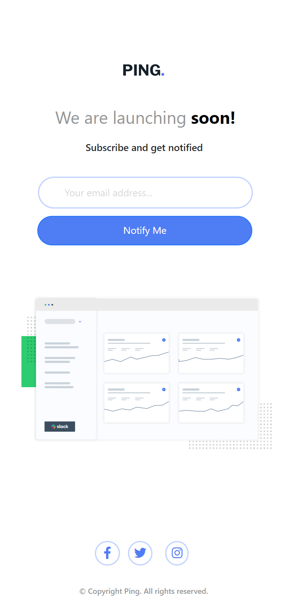
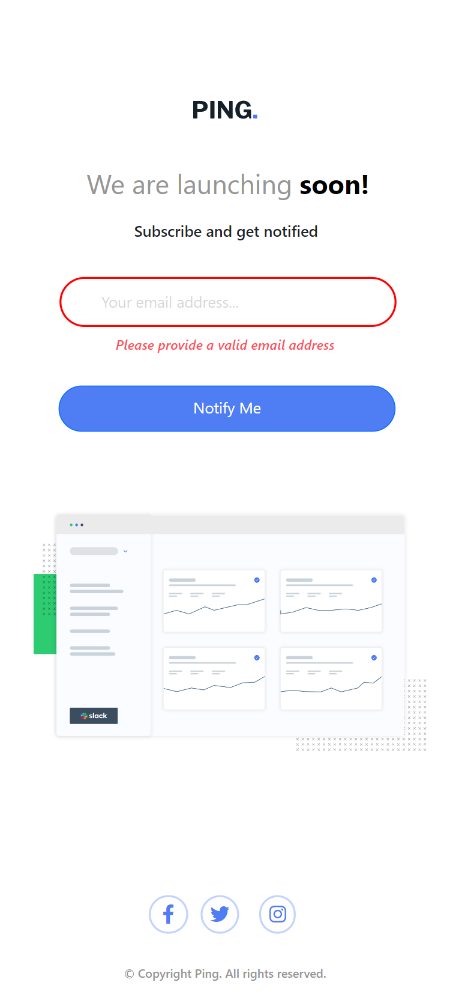
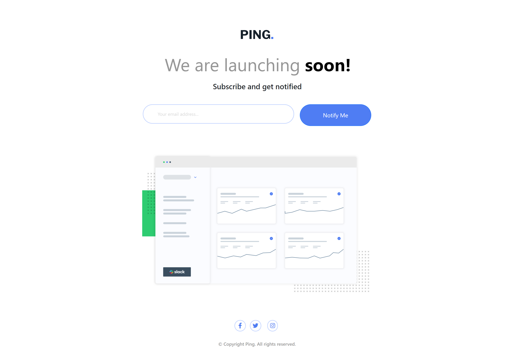
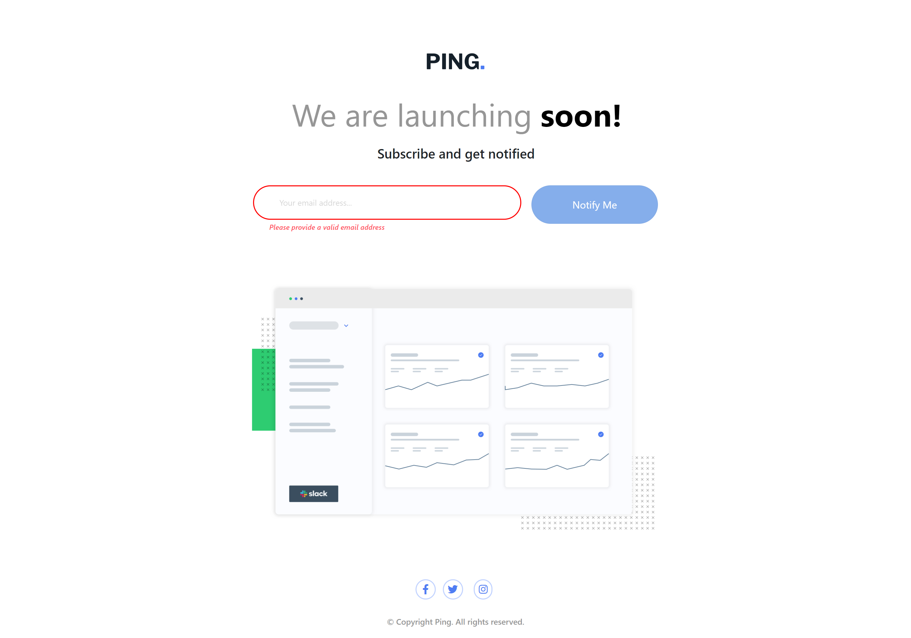

# Frontend Mentor - Ping coming soon page solution

This is a solution to the [Ping coming soon page challenge on Frontend Mentor](https://www.frontendmentor.io/challenges/ping-single-column-coming-soon-page-5cadd051fec04111f7b848da). Frontend Mentor challenges help you improve your coding skills by building realistic projects. 

## Table of contents

- [Overview](#overview)
  - [The challenge](#the-challenge)
  - [Screenshot](#screenshot)
  - [Links](#links)
- [My process](#my-process)
  - [Built with](#built-with)
- [Author](#author)

## Overview

### The challenge

Users should be able to:

- View the optimal layout for the site depending on their device's screen size
- See hover states for all interactive elements on the page
- Submit their email address using an `input` field
- Receive an error message when the `form` is submitted if:
	- The `input` field is empty. The message for this error should say *"Whoops! It looks like you forgot to add your email"*
	- The email address is not formatted correctly (i.e. a correct email address should have this structure: `name@host.tld`). The message for this error should say *"Please provide a valid email address"*

### Screenshot
- Mobile View:

;
---

- Desktop View:

---

### Links

- Solution URL: [Frontend-Mentor](https://www.frontendmentor.io/solutions/ping-coming-soon-page-with-bootstrap-jquery-yUgh3Oklir)
- Live Site URL: [Github](https://amrmabdelazeem.github.io/ping-coming-soon-page/)

## My process

- Built the HTML structure.
- Applied CSS styling to the page.
- Built mobile fist view.
- Programmed the button to validate the email.
- Built desktop view.
- Adjusted the page to fit the design properly.

### Built with

- Semantic HTML5 markup
- CSS custom properties
- Flexbox
- CSS Grid
- Mobile-first workflow
- Responsive Web Design
- [Bootstrap](https://getbootstrap.com/) - Frontend
- [jQuery](https://jquery.com/) - JS framework

## Author

- Website - [Github](https://github.com/amrmabdelazeem)
- Frontend Mentor - [@amrmabdelazeem](https://www.frontendmentor.io/profile/amrmabdelazeem)
